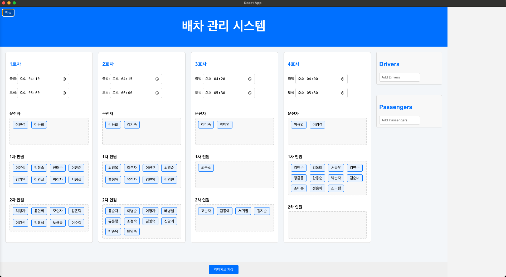

# Vehicle Management System

## 프로젝트 소개

이 프로젝트는 Electron과 React를 사용하여 개발된 **배차 관리 시스템**입니다. 차량별로 운전자와 탑승자를 관리하며, 데이터를 저장하고 불러올 수 있는 기능을 제공합니다.



## 주요 기능

1. **운전자 및 탑승자 관리**

   - 운전자와 탑승자를 추가, 삭제, 정렬.
   - Drag & Drop으로 차량별 배차 그룹(운전자, 1차 인원, 2차 인원)에 배치 가능.

2. **차량 및 배차 그룹 관리**

   - 각 차량별로 운전자, 1차 인원, 2차 인원을 그룹으로 관리.
   - 출발 및 도착 시간을 수정 가능.

3. **배차 기록 저장 및 불러오기**

   - 배차 기록을 제목별로 저장하고, 불러오기 가능.

4. **데이터 저장**

   - JSON 파일을 활용하여 로컬에 데이터 저장.

5. **사용자 친화적 UI**
   - 직관적인 Drag & Drop UX.
   - 네비게이션 바로 배차 기록을 관리.

## 설치 및 실행

### 필요한 환경

- Node.js
- npm 또는 yarn
- Electron

### 설치

```bash
git clone https://github.com/your-repo/vehicle-management.git
cd vehicle-management
npm install
```

### Test 환경

```bash
npm run build && npm run electron-dev
```

### 배포

```bash
## mac OS
npm run dist

## win OS
npx @electron/packager . MyApp --platform=win32 --arch=x64 --out=dist --overwrite

```
